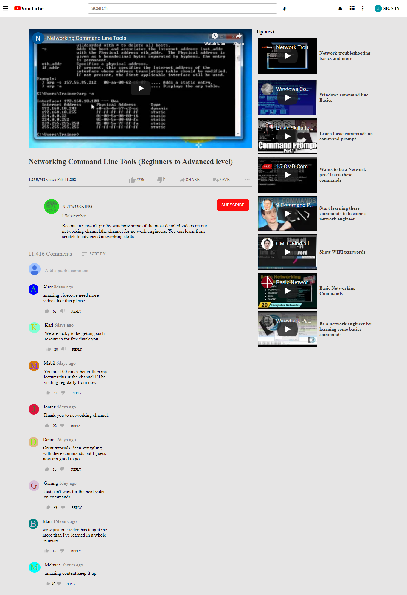

# HTML & CSS: Embedding videos on a page

I randomly picked some videos from youtube and embedded them on the page.

This project involves embedding videos. It's more like cloning a youtube page where there is the main video and the side videos that more often appear on the right side of the page. Below the main video are the number of views,the buttons for likes,dislikes,share and the subscribe button. It continues with the channel name and logo which are directly on the left side of the subscribe button. Then comes the comments section just below the described content. It's not possible to add comments to the page since it's more of a clone. The buttons cannot respond to any click as well. On top of the page is the nav bar containing the search bar,the icons and the sign in button. the icons cannot respond to clicks.

## Built With

- HTML
- CSS

## Live Demo

[Embedding-Videos](https://rawcdn.githack.com/garang96/Embedding-Videos/pull/1#issue-568988875)

## Authors

👤 **John alier Garang**

- Github: [@garang96](https://github.com/garang96)

## Contributing

Contributions,issues,and feature requests are welcomed!

Feel free to check the [issues page](https://rawcdn.githack.com/garang96/Embedding-Videos/tree/Embbeding)

## Show your support

Give a star if you like this project!

## Acknowledgements

* hat hit for anyone whose code was used
* inspiration
* etc

## License

This project is [MIT](https://rawcdn.githack.com/garang96/Embedding-Videos/tree/Embbeding) licensed.

